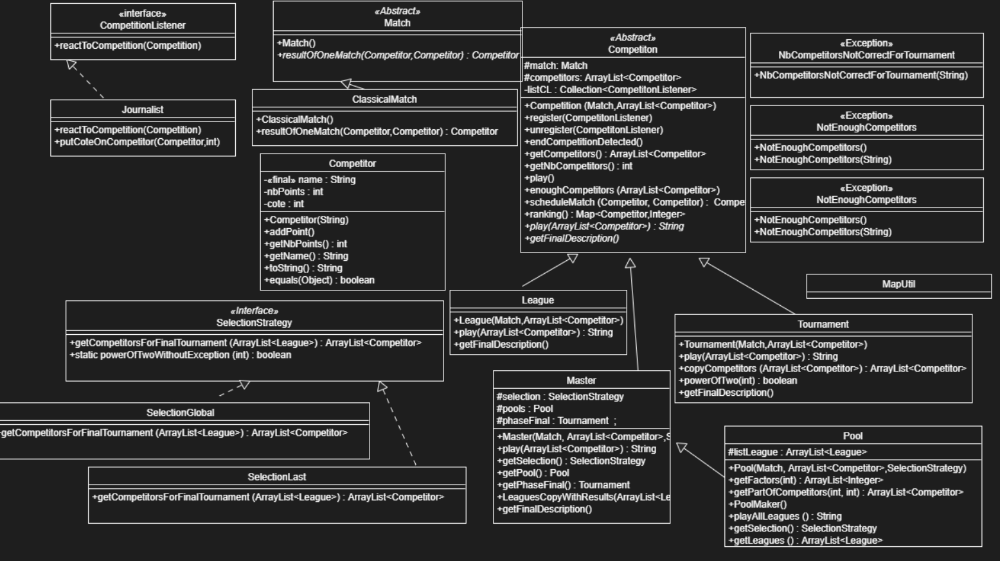

# Projet Competition sportive

---

### But du projet

Le but de ce projet est d'organiser des compétitions sportives. Il existe différents types de compétition, tel que les `League` et le `Tournament`. Chaque competition possède un type de `Match` comme `ClassicalMatch` (match classique, concidérant que chaque compétiteur a les mêmes chances de gagner). Le programe principal est capable de *faire jouer* des Compétitions sportives avec différents types de `Match` et différents types de `Compétition`.

---

### HOWTO

Voici l'ensemble des instructions et commande à effectuer pour faire fonctionner le projet.

##### Récuperer le dépot GIT

Pour récuperer le dépot GIT, placer vous où vous le souhaitez sur votre ordianteur et faites :

```
git clone https://gitlab-etu.fil.univ-lille1.fr/bailleux/bailleux_tahtaoui_coo_l3.git
```

Vous allez voir apparaitre un dossier`bailleux_tahtaoui_coo_l3`, ouvrez-le (avec un `cd bailleux_tahtaoui_coo_l3/`) et executez les commandes qui suivent dans ce dossier.

##### Compilation du projet

Pour compiler le projet, allez dans le dossier `src` puis faites :

```
javac sport_competition/*.java -d ../classes
```

##### Générer la JavaDoc

Pour génére la JavaDoc, allez dans le dossier `src` puis faites :

```
javadoc -d ../docs -subpackages sport_competition

```

La documentation sera ainsi disponible dans le dossier `docs`.

##### Générer et executer les test

Pour générer et executer les test, rester dans le dossier `bailleux_tahtaoui_coo_l3` et faites :

```
javac -classpath test-1.7.jar test/sport_competition/CompetitorTest.java
javac -classpath test-1.7.jar test/sport_competition/CompetitionTest.java
javac -classpath test-1.7.jar test/sport_competition/LeagueCompetitionTest.java
javac -classpath test-1.7.jar test/sport_competition/TournamentCompetitionTest.java
javac -classpath test-1.7.jar test/sport_competition/MatchTest.java
javac -classpath test-1.7.jar test/sport_competition/ClassicalMatchTest.java
javac -classpath test-1.7.jar test/sport_competition/MasterCompetitionTest.java
javac -classpath test-1.7.jar test/sport_competition/PoolTest.java
javac -classpath test-1.7.jar test/sport_competition/SelectionGlobaleTest.java
javac -classpath test-1.7.jar test/sport_competition/SelectionLastTest.java
java -jar test-1.7.jar sport_competition.CompetitorTest
java -jar test-1.7.jar sport_competition.LeagueCompetitionTest
java -jar test-1.7.jar sport_competition.TournamentCompetitionTest
java -jar test-1.7.jar sport_competition.ClassicalMatchTest
java -jar test-1.7.jar sport_competition.MasterCompetitionTest
java -jar test-1.7.jar sport_competition.PoolTest
java -jar test-1.7.jar sport_competition.SelectionGlobaleTest
java -jar test-1.7.jar sport_competition.SelectionLastTest
```

##### Générer l'archive executable

Pour construire l'archive executable, allez dans le dossier `classes` puis faites : 

```
jar cvfm ../sport_competition.jar ../manifest-sc sport_competition
```

##### Execution de l'archive précedemment générée

Dans le dossier principal du projet, faites :

```
java -jar sport_competition.jar
```

---

### Présentation d'éléments de code saillant 
#### V1

- Création d'une classe abstraite `Competition`
  
  - `League` y hérite
  
  - `Tournament` y hérite également
  
  - Dans le futur, cela permettra de créer d'autre type de `Compétition`, puisqu'elles ont tous un comportement commun

- Création d'une classe abstraite `Match`
  
  - `ClassicalMatch` y hérite
  
  - Il n'y a qu'un type de `Match`, pour l'instant. La création de cette classe abstraite sera surtout utile, par la suite, lorsqu'on devra instancier d'autres types de `Match` !

- Pour les tests :
  
  - Une classe `MockMatch` a été crée dans `MatchTest` afin de forcer un comportement pour tester la fonction `resultOfOneMatch()`. `ClassicalMatch` faisant appel au hasard dans `resultOfOneMatch()`, cela était impossible de passer par cette classe pour effectuer divers tests de cette fonction

- Les exceptions :
  
  - Deux exceptions ont été crée dans le projet :
    
    - `NbCompetitorsNotCorrectForTournament` dans le cas où on essayerai de *faire jouer* un tournois (`Tournament`) avec un nombre de compétiteurs (`Competitor`) qui n'est pas un une puissance de 2.
    
    - `NotEnoughCompetitors` dans le cas dans le cas où on essayerai de *faire jouer* une Compétition avec un nombre de joueur inférieur à 2

#### V2

- Création d'un design pattern Strategy `SelectionStrategy` (interface) pour les methodes de sélection des compétiteurs pour le Tournois final de la classe Master.

- `Master` hérite de `Competition`

- `Pool` "hérite" de `Master` ; cette classe nous sert à crée l'ensemble des Pools de la Master et de les faire jouer. 


#### V3

- Ajout du Design Pattern Observateur

- Création d'une interface `CompetitionListener`

- Création de la classe `Journalist` qui implemente ``CompetitionListener`

- Création d'une fonction abstraite `getFinalDescription` dans tous les types de compétition pour effectuer un affichage différent selon le type de `Competition`

- Ajout des côtes sur les `Competitor` et les journalistes/bookmakers peuvent faire évoluer les cotes des joueurs
---

### Diagramme de classes

Sur le dépot sous le nom de : `diagramme_classes.png`

  

